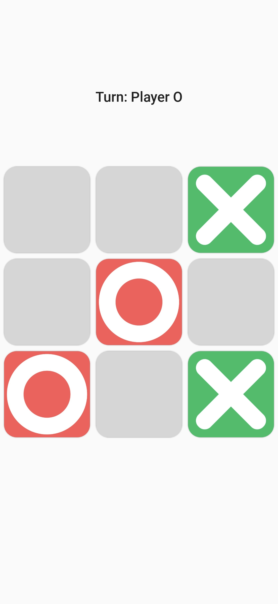
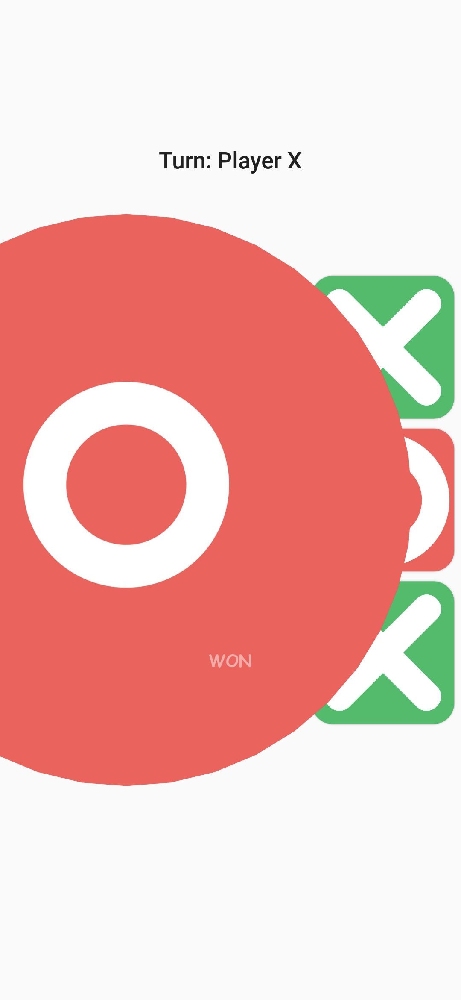
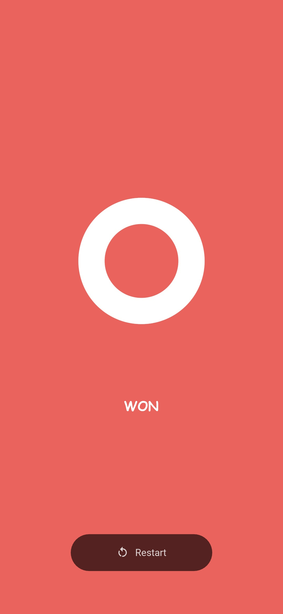
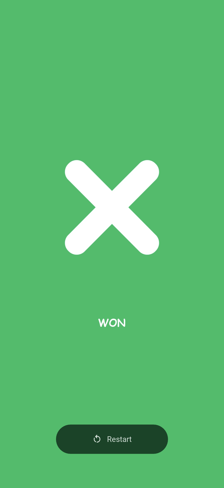

# 🎮 Tic-Tac-Toe Game

A simple and interactive Tic-Tac-Toe game built using **Python** and **KivyMD**, designed for two players with a smooth UI experience. This project helped me understand core UI concepts, state management, and event handling in mobile app development using Kivy.

---

## 📱 Preview

<table>
  <tr>
    <td></td>
    <td></td>
    <td></td>
    <td></td>
  </tr>
</table>

## 🎥 [Watch Demo]
> [](https://youtu.be/iwBhbxgoezg)

---

## 🚀 Features

- ✅ 3x3 game board with responsive touch controls  
- ✅ Highlights winning combinations  
- ✅ Displays game result: Win / Draw  
- ✅ Reset game button for instant replay  
- ✅ Simple, user-friendly layout built with KivyMD components  

---

## 🧠 What I Learned

- Building mobile UIs using **KivyMD**
- Managing game states and player turns
- Event handling and UI updates
- Structuring layouts using `BoxLayout`, `GridLayout`, etc.

---

## 🛠️ Tech Stack

- **Language:** Python  
- **Framework:** KivyMD (based on Kivy)  
- **Tools:** VS Code, Git, Python 3.x

---

## 📂 Installation & Running

1. **Clone this repo:**

   ```bash
   git clone https://github.com/yourusername/tictactoe-kivymd.git
   cd tictactoe-kivymd
